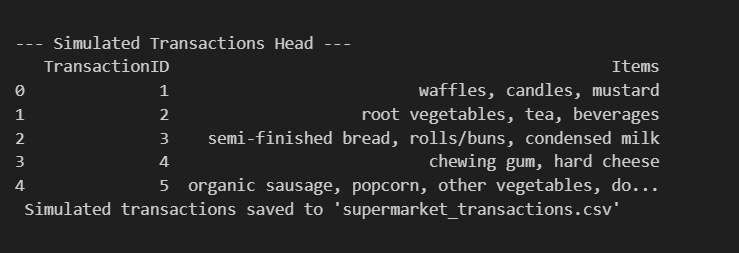
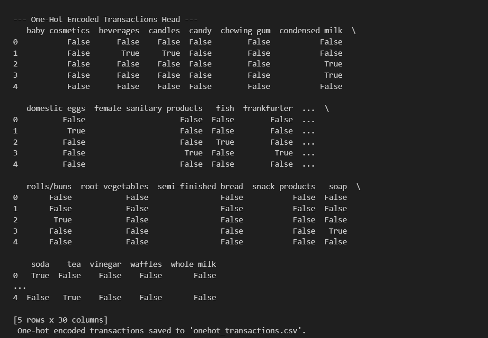
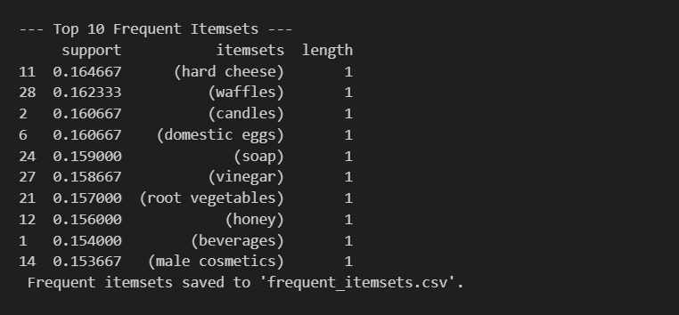
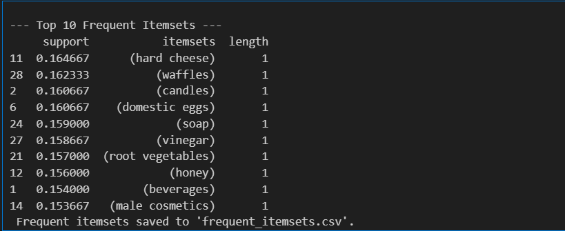
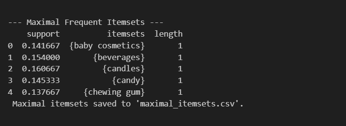

# Frequent Itemsets: Closed vs Maximal in Supermarket Data

This project explores **frequent itemset mining** using the **Apriori algorithm** on simulated supermarket transaction data. We focus on identifying **Frequent Itemsets**, **Closed Frequent Itemsets**, and **Maximal Frequent Itemsets**.

The goal is to demonstrate how different types of itemsets can provide insights into shopping patterns.

---

##  Project Overview

This project consists of the following key steps:

1. **Simulating Transactions**
2. **Preprocessing with One-Hot Encoding**
3. **Mining Frequent Itemsets (Apriori Algorithm)**
4. **Identifying Closed Frequent Itemsets**
5. **Identifying Maximal Frequent Itemsets**

All results are saved in `.csv` files and analyzed in a fully commented Python notebook.

---

## Group Members & Contributions

| Name                | Email                   |                              
|---------------------|---------------------------|
| Merhawit Tesfay      |merhawitwukro@email.com       
| Faith Chakwanira     |faithchakwanira@gmail.com
| Nicholas Kinyanjui   |nicholas25gunda@gmail.com

## Files in This Repository

| File                               | Description                                         |
|-------------------------------------|-----------------------------------------------------|
| `supermarket_transactions.csv`     | Raw simulated transactions                         |
| `onehot_transactions.csv`          | One-hot encoded transaction matrix                 |
| `frequent_itemsets.csv`            | Frequent itemsets from Apriori                     |
| `closed_itemsets.csv`              | Filtered closed itemsets                           |
| `maximal_itemsets.csv`             | Filtered maximal itemsets                          |
| `frequent_itemsets_analysis.ipynb` | Fully commented notebook with code and explanations|
| `README.md`                        | Project overview and group contributions           |

---

##  1. Simulating Transactions

We simulated **3,000 supermarket shopping trips** using 30 randomly selected products from a larger dataset of 167 unique supermarket items.

**Output:**

---

##  2. One-Hot Encoding

We converted the transactions into a **binary matrix** (True/False) for algorithm processing.

**Output:**

---
We transformed all shopping trips into a table of checkboxes so a computer can understand them. Each row represents one shopper’s trip, and each column shows if they bought a specific product. For example, one shopper bought soda but not milk or eggs. This new format makes it easier for us to find patterns, like which items are often bought together. We saved this table for the next step of analysis.
##  3. Frequent Itemsets (Apriori)

We applied the Apriori algorithm with a **minimum support of 5%** to find frequent patterns.

**Output:**
**Top 10 Frequent Itemsets:**
 

We analyzed the shopping trips to find the most popular products. For example, hard cheese was bought in 16% of all trips, and waffles in about 16% too. These are the items that customers buy most often. This helps us understand customer preferences and which products are ‘frequent shoppers’ in baskets. We saved all frequent product patterns in a file for further analysis.

---

##  4. Closed Frequent Itemsets

We identified **Closed Frequent Itemsets** where no superset has the same support.
Closed itemsets help eliminate redundancy by keeping only patterns with unique support values.

**Output:**

We analyzed 3,000 simulated shopping trips to find the most popular products. Hard cheese was the most common, appearing in 16.5% of baskets. Waffles and candles were also very frequent. This helps us see what customers tend to buy most often. We saved these popular products and combinations for further analysis.

---

## 5. Maximal Frequent Itemsets

We identified **Maximal Frequent Itemsets** where no superset is frequent.
Maximal itemsets highlight the largest significant patterns.

**Output:**

We found the largest and most important shopping patterns in our data. For example, ‘candles’ appeared in 16% of all shopping trips, and no bigger group of products was bought as frequently. These ‘maximal’ patterns are useful because they show us the strongest and most unique buying habits without any redundancy. We saved them for future insights.

##  How to Run the Code

1. Clone this repository:

git clone  https://github.com/Merhawitm/frequent-itemsets-group-1-

2. Install required Python libraries:

3. Open `frequent_itemsets_analysis.ipynb` in Jupyter Notebook or run the Python scripts.

---

##  Notes for Non-Technical Users

- **Frequent Itemsets**: Products that are often bought together.  
- **Closed Itemsets**: Patterns where no larger group appears equally often.  
- **Maximal Itemsets**: Largest frequent groups; they summarize important patterns.  

This analysis helps businesses **discover shopping trends** and **design promotions** based on real-world patterns.

